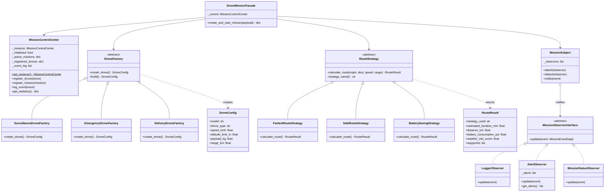
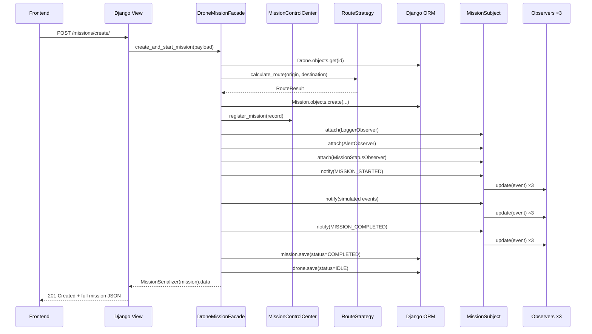
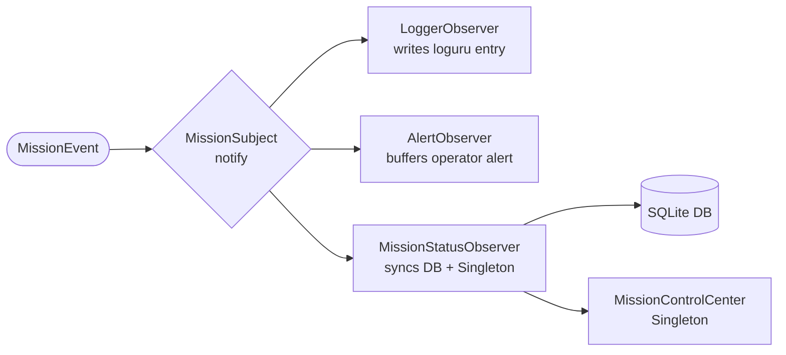

# Vesper Drone Mission Control

> A modern urban drone coordination platform designed for smart-city operations in Maricá/RJ, Brazil.  
> Built as a portfolio-grade software architecture project demonstrating five classical Design Patterns in a realistic full-stack application.

---

## Table of Contents

1. [Overview](#overview)
2. [Architecture](#architecture)
3. [Design Patterns](#design-patterns)
4. [Project Structure](#project-structure)
5. [Tech Stack](#tech-stack)
6. [Getting Started](#getting-started)
7. [API Reference](#api-reference)
8. [UML Diagrams](#uml-diagrams)
9. [Simulation Flow](#simulation-flow)
10. [Future Improvements](#future-improvements)

---

## Overview

Vesper is a mission control dashboard for coordinating drone fleets performing smart-city operations:

| Operation | Regions Covered |
|---|---|
| Flood Monitoring | Itaipuaçu, Ponta Negra |
| Coastal Patrol | Cordeirinho, São José |
| Emergency Delivery | Centro, Inoã |
| Traffic Surveillance | Centro, São José |
| Environmental Monitoring | All regions |

The system simulates the complete mission lifecycle: deployment, routing, real-time event generation, observer notifications, and status tracking — all backed by a clean, pattern-driven architecture.

---

## Architecture

```
┌─────────────────────────────────────────────────────────┐
│                     FRONTEND (React)                     │
│  Dashboard │ Create Mission │ Active Missions │ Logs     │
└──────────────────────────┬──────────────────────────────┘
                           │ HTTP/REST
┌──────────────────────────▼──────────────────────────────┐
│                    DJANGO REST API                        │
│   /drones  /missions/create  /missions  /system/status   │
└──────────────────────────┬──────────────────────────────┘
                           │
┌──────────────────────────▼──────────────────────────────┐
│               FACADE (DroneMissionFacade)                 │
│  Orchestrates all subsystems behind a single entry point  │
└────┬──────────────┬──────────────┬────────────────┬──────┘
     │              │              │                │
  SINGLETON      FACTORY       STRATEGY         OBSERVER
  Control        Drones        Routes           Events
  Center         Creation      Algorithms       Notifications
```

### Core Principles

- **Clean Architecture** — domain logic is isolated from framework concerns
- **SOLID** — single responsibility per class, open for extension, closed for modification
- **Explicit Patterns** — each pattern is isolated in its own module with header comments
- **No God Objects** — the Facade delegates; it does not implement business logic directly

---

## Design Patterns

### 1. Singleton — `MissionControlCenter`

**Location:** `backend/core/singleton/mission_control_center.py`

**Why:** Only one central control room may exist. The Singleton guarantees that every subsystem (API, Facade, Observers) shares identical state — preventing double-dispatch bugs where two separate registries could hold diverging drone status.

**Implementation:**
```python
class MissionControlCenter:
    _instance: Optional[MissionControlCenter] = None
    _initialized: bool = False

    def __new__(cls) -> MissionControlCenter:
        if cls._instance is None:
            cls._instance = super().__new__(cls)
        return cls._instance

    @classmethod
    def get_instance(cls) -> MissionControlCenter:
        if cls._instance is None:
            cls()
        return cls._instance
```

**Responsibilities:** track active missions · register drones · collect events · expose statistics

---

### 2. Factory Method — `DroneFactory`

**Location:** `backend/drones/factories/`

**Why:** Each drone type has meaningfully different hardware specs. The Factory Method pattern decouples drone creation from the calling code, making it trivial to add a new drone variant without modifying any existing class.

```
DroneFactory (abstract)
  ├── SurveillanceDroneFactory  →  Vesper-S400 Sentinel  (95 km/h · 60 km range)
  ├── EmergencyDroneFactory     →  Vesper-E200 Raptor    (140 km/h · 35 km range)
  └── DeliveryDroneFactory      →  Vesper-D800 Carrier   (65 km/h  · 25 km range)
```

Each factory implements `create_drone() → DroneConfig` and returns a fully-specified value object.

---

### 3. Strategy — `RouteStrategy`

**Location:** `backend/missions/strategies/`

**Why:** Route calculation involves fundamentally different trade-offs (speed vs safety vs battery) that vary independently of the mission itself. Strategy makes these algorithms interchangeable at runtime.

```
RouteStrategy (abstract)
  ├── FastestRouteStrategy     — Direct path, maximum speed, ignores weather (risk: 0.45)
  ├── SafeRouteStrategy        — Detour through cleared airspace (risk: 0.10)
  └── BatterySavingStrategy    — Coastal low-altitude, wind-assisted (risk: 0.25)
```

Each strategy returns a `RouteResult` with: `distance_km`, `estimated_duration_min`, `battery_consumption_pct`, `weather_risk_score`, `waypoints`.

---

### 4. Observer — `MissionSubject` + Observers

**Location:** `backend/core/events/` · `backend/missions/observers/`

**Why:** Mission lifecycle events must notify multiple independent systems without coupling them. Adding a new observer (e.g. `SlackNotifierObserver`) requires zero changes to the subject.

```
MissionSubject
  ├── attach(observer)
  ├── detach(observer)
  └── notify(event) ──→ LoggerObserver         # writes structured logs via loguru
                    ──→ AlertObserver           # buffers operator alerts for critical events
                    └── MissionStatusObserver  # syncs DB + Singleton registry
```

**Events fired:** `MISSION_STARTED` · `MISSION_COMPLETED` · `LOW_BATTERY` · `BAD_WEATHER` · `SIGNAL_LOST` · `OBSTACLE_DETECTED`

---

### 5. Facade — `DroneMissionFacade`

**Location:** `backend/core/facade/drone_mission_facade.py`

**Why:** Without the Facade, every API view would need to coordinate five independent subsystems. The pattern hides that complexity behind one method call, keeps views thin, and provides a single seam for testing.

```python
facade = DroneMissionFacade()
result = facade.create_and_start_mission(payload)
# Internally: loads drone → computes route → persists mission →
#             attaches observers → fires events → syncs DB → returns result
```

---

## Project Structure

```
vesper-drone-mission-control/
├── docker-compose.yml
├── README.md
│
├── backend/
│   ├── Dockerfile
│   ├── requirements.txt
│   ├── manage.py
│   │
│   ├── config/                    # Django project config
│   │   ├── settings.py
│   │   └── urls.py
│   │
│   ├── core/                      # Pure domain layer (no Django deps)
│   │   ├── enums/                 # All system enumerations
│   │   ├── singleton/             # ★ Singleton pattern
│   │   │   └── mission_control_center.py
│   │   ├── events/                # ★ Observer pattern (Subject + interface)
│   │   │   └── mission_events.py
│   │   └── facade/                # ★ Facade pattern
│   │       └── drone_mission_facade.py
│   │
│   ├── drones/
│   │   ├── factories/             # ★ Factory Method pattern
│   │   │   ├── base_factory.py
│   │   │   ├── surveillance_factory.py
│   │   │   ├── emergency_factory.py
│   │   │   └── delivery_factory.py
│   │   ├── models.py
│   │   └── serializers.py
│   │
│   ├── missions/
│   │   ├── strategies/            # ★ Strategy pattern
│   │   │   ├── base_strategy.py
│   │   │   ├── fastest_route.py
│   │   │   ├── safe_route.py
│   │   │   └── battery_saving.py
│   │   ├── observers/             # ★ Observer pattern (Concrete observers)
│   │   │   ├── logger_observer.py
│   │   │   ├── alert_observer.py
│   │   │   └── mission_status_observer.py
│   │   ├── models.py
│   │   └── serializers.py
│   │
│   └── api/
│       ├── views/                 # Thin HTTP handlers
│       └── urls/
│
└── frontend/
    ├── Dockerfile
    ├── src/
    │   ├── api/                   # Axios API layer
    │   ├── components/
    │   │   ├── layout/            # Sidebar, TopBar, Layout
    │   │   ├── dashboard/         # StatCard, MissionCard, DroneStatusCard, EventFeed
    │   │   └── mission/           # MissionTimeline
    │   └── pages/                 # Dashboard, CreateMission, ActiveMissions, MissionLogs
    └── tailwind.config.js
```

---

## Tech Stack

| Layer | Technology |
|---|---|
| Backend | Python 3.12 · Django 5 · Django REST Framework |
| Logging | loguru · Rich |
| Frontend | React 18 · Vite · TailwindCSS · Axios · Lucide Icons |
| Database | SQLite (dev) |
| Container | Docker · Docker Compose |

---

## Getting Started

### Prerequisites
- Docker and Docker Compose installed

### Run

```bash
git clone <repo>
cd vesper-drone-mission-control
cp .env.example .env
docker compose up --build
```

| Service | URL |
|---|---|
| Frontend | http://localhost:5173 |
| Backend API | http://localhost:8000/api |

The backend automatically runs `python manage.py seed_demo` on first start, which:
1. Creates 6 drones using the **Factory Method** pattern
2. Registers them with the **Singleton** registry
3. Runs 2 sample missions through the **Facade**

### Run without Docker

```bash
# Backend
cd backend
pip install -r requirements.txt
python manage.py migrate
python manage.py seed_demo
python manage.py runserver

# Frontend (separate terminal)
cd frontend
npm install
npm run dev
```

---

## API Reference

| Method | Endpoint | Description |
|---|---|---|
| GET | `/api/drones/` | List all drones |
| GET | `/api/drones/{id}/` | Get drone detail |
| GET | `/api/missions/` | List all missions |
| POST | `/api/missions/create/` | Create + start mission (via Facade) |
| GET | `/api/missions/{id}/` | Get mission with timeline |
| GET | `/api/missions/logs/` | All mission events |
| GET | `/api/system/status/` | Singleton stats + recent events |
| GET | `/api/system/metadata/` | Enum options for form dropdowns |

### Create Mission — Request Body

```json
{
  "name": "Flood Watch Alpha",
  "mission_type": "FLOOD_MONITORING",
  "region": "Itaipuaçu",
  "priority": "HIGH",
  "drone_id": "<uuid>",
  "route_strategy": "SAFE"
}
```

---

## UML Diagrams

### Class Diagram — Design Patterns



---

### Sequence Diagram — Mission Lifecycle



---

### Observer Flow Diagram



---

## Simulation Flow

When a mission is created through the frontend:

1. **Select** mission type, Maricá region, drone, and route strategy
2. **Submit** → POST to `/api/missions/create/`
3. **Facade** receives the request and:
   - Loads the drone via DB (created by Factory Method at seed time)
   - Selects and executes the chosen Route Strategy
   - Persists the Mission model
   - Assembles the Observer chain
   - Fires `MISSION_STARTED` → all observers react
   - Simulates 0–2 random mid-mission events (weather, battery, signal)
   - Fires `MISSION_COMPLETED` → observers sync final state
4. **Response** includes the full mission record + event timeline
5. **Dashboard** live-polls system status from the Singleton registry

### Example Simulation Events

| Event | Severity | Observer Reactions |
|---|---|---|
| `MISSION_STARTED` | INFO | Logger → log, StatusObs → DB ACTIVE |
| `BAD_WEATHER` | ALERT | Logger → warning, AlertObs → operator alert |
| `LOW_BATTERY` | WARNING | Logger → warning, AlertObs → operator alert |
| `MISSION_COMPLETED` | SUCCESS | Logger → success, StatusObs → DB COMPLETED, drone IDLE |

---

## Future Improvements

| Improvement | Notes |
|---|---|
| WebSocket live updates | Replace polling with Django Channels |
| PostgreSQL | Replace SQLite for production |
| JWT Authentication | Operator login and role-based access |
| Command Pattern | Undo/redo mission operations |
| Decorator Pattern | Dynamic drone capability augmentation |
| State Machine | Explicit drone lifecycle states (FSM) |
| Real drone telemetry | MAVLink protocol integration |
| Kubernetes deployment | Helm chart for production scale |

---

## Academic Notes

This project was designed to satisfy requirements for Software Architecture and Design Patterns coursework. Each pattern is:

- **Explicitly implemented** — not simulated or faked
- **Meaningfully placed** — each pattern solves a real design problem in the domain
- **Well-separated** — each pattern lives in its own module with explanatory header comments
- **Interconnected** — the Facade composes all other patterns, demonstrating pattern interaction

The five patterns together demonstrate: creational (Factory Method), structural (Facade), and behavioural (Singleton, Strategy, Observer) categories of the GoF taxonomy.

---

*Vesper Drone Mission Control · Maricá/RJ Smart City Operations*
